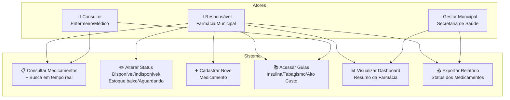
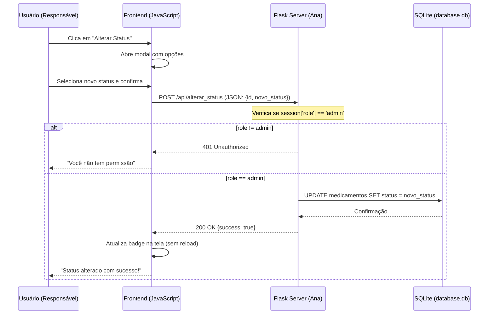

**Perfeito!** ✅

Agora vou criar o `06-WIREFRAME_IDEAS.md` para o **SEU projeto** (Site Gestão de Medicamentos - Farmácia Municipal de Itamonte), seguindo **exatamente o mesmo formato, estrutura, emojis e estilo** do exemplo, mas **substituindo todo o conteúdo** pelo seu sistema.

---

# 🗺️ 06-WIREFRAME_IDEAS.md: Arquitetura Visual e Esboços

## 📑 1. Objetivo da Arquitetura

Este documento serve como o "esqueleto" e guia visual para a implementação do **Site Gestão de Medicamentos - Farmácia Municipal de Itamonte**. Ele garante a aplicação da **Regra 80/20** (foco no que entrega valor: consulta rápida e atualização de status) e do princípio **Data-First**, onde a interface respeita rigorosmente o contrato do `SCHEMA.md`.

---

## 👥 2. Diagrama de Caso de Uso (DCU)

*Visão funcional de alto nível descrevendo quem faz o quê no sistema.*



---

## 📱 3. Wireframe: Tela de Login (Todos os Usuários)

*Foco: Acesso simples e seguro para profissionais da UBS.*

**Estrutura Visual:**

1. **Header:** Logo "Farmácia Municipal de Itamonte" + fundo Glassmorphism.
2. **Card Central (Glassmorphism):**
   - Fundo com `blur(10px)` e borda fina branca.
   - Campo `username`: "Usuário" (placeholder: "digite seu login")
   - Campo `password`: "Senha" (type="password")
   - Link informativo: "Acesso restrito a profissionais de saúde"
3. **Botão CTA:** "Entrar" (Cor sólida verde para contraste AAA).
4. **Feedback:** Mensagem de erro se credenciais inválidas.

---

## 🖥️ 4. Wireframe: Dashboard / Página Inicial (Pós-Login)

*Foco: Visão geral e acesso rápido às principais seções.*

**Estrutura Visual:**

1. **Header/Navbar:**
   - Logo | Medicamentos | Guia Insulina | Alto Custo | Estratégicos | Tabagismo | (Admin: + Cadastrar)
   - Indicador de usuário logado: "Olá, [Nome] 👋" + Badge "Responsável" ou "Consultor"
2. **Hero Section:**
   - Título: "Bem-vindo ao Portal de Medicamentos"
   - Subtítulo: "Plataforma de consulta para os profissionais de saúde do município de Itamonte"
3. **Cards de Acesso (Grid 2x3):**
   | Card | Descrição | Link |
   | :--- | :--- | :--- |
   | 💊 Medicamentos | Consulte todos os medicamentos com posologia, classificação e disponibilidade | `/medicamentos` |
   | 💉 Guia de Insulina | Como utilizar insulina NPH e Regular — frasco, caneta, agulhas | `/guia-insulina` |
   | 📊 Monitor de Glicose | Como conseguir o monitor, tiras reagentes e quantidades | `/monitor-glicose` |
   | 💰 Medicamentos de Alto Custo | CEAF — doenças contempladas e formulários de solicitação | `/alto-custo` |
   | 🧪 Medicamentos Estratégicos | Hanseníase, Tuberculose, Influenza, Chagas, Parasitoses | `/estrategicos` |
   | 🚭 Cessação do Tabagismo | Adesivos, gomas e Bupropiona disponíveis na farmácia | `/tabagismo` |

---

## 📋 5. Wireframe: Tela de Medicamentos (Lista + Busca + Status)

*Foco: Consulta rápida e (para admin) edição de status.*

**Estrutura Visual:**

1. **Header da Página:**
   - Título: "Medicamentos"
   - Subtítulo: "152 medicamentos cadastrados"
2. **Barra de Busca:**
   - Ícone de lupa + input "Buscar medicamento..." (filtro em tempo real)
3. **Filtro por Classificação (opcional):**
   - Dropdown: "Todas as classes" | Analgésicos | Anti-hipertensivos | Antibióticos | ...
4. **Lista de Medicamentos (Cards ou Tabela):**
   ```
   ┌─────────────────────────────────────────────────────────────────┐
   │ 🔹 ANALGÉSICOS E ANTIPIRÉTICOS                                  │
   ├─────────────────────────────────────────────────────────────────┤
   │ 💊 Dipirona 500mg cp                                            │
   │    POSOLOGIA: 500-1000mg a cada 6-8h (máx. 4g/dia)             │
   │    INDICAÇÃO: Dor e febre                                       │
   │    STATUS: [🟢 Disponível]                                      │
   │    └─ [✏️ Alterar Status] (visível só para admin)              │
   ├─────────────────────────────────────────────────────────────────┤
   │ 💊 Paracetamol 500mg                                            │
   │    POSOLOGIA: 500-1000mg a cada 6-8h (máx. 4g/dia)             │
   │    INDICAÇÃO: Dor leve a moderada e febre                       │
   │    STATUS: [🟡 Estoque baixo]                                   │
   │    └─ [✏️ Alterar Status] (visível só para admin)              │
   └─────────────────────────────────────────────────────────────────┘
   ```

5. **Badges de Status (Cores):**
   | Status | Cor | Badge |
   | :--- | :--- | :--- |
   | Disponível | 🟢 Verde | `Disponível` |
   | Estoque baixo | 🟡 Amarelo | `Estoque baixo` |
   | Aguardando entrega | 🔵 Azul | `Aguardando entrega` |
   | Indisponível | 🔴 Vermelho | `Indisponível` |

6. **Modal de Alteração de Status (Admin):**
   - Ao clicar em "Alterar Status", abrir modal com:
     - "Medicamento: Dipirona 500mg cp"
     - "Status atual: Disponível"
     - Radio buttons com os 4 status possíveis
     - Botão "Confirmar" + "Cancelar"
     - Mensagem de confirmação pós-alteração

---

## 📚 6. Wireframe: Guia Prático de Insulina

*Foco: Conteúdo educativo claro e acessível.*

**Estrutura Visual (Baseada nos Anexos 3 e 4):**

1. **Header da Página:**
   - Título: "Guia Prático de Insulina"
   - Subtítulo: "Como utilizar insulina NPH e Regular"

2. **Seção 1: Tipos de Insulina (Tabela comparativa):**
   | Tipo | Aspecto | Início | Pico | Duração | Uso |
   | :--- | :--- | :--- | :--- | :--- | :--- |
   | **NPH** | Leitosa (turva) | 2-4h | 4-10h | 10-18h | Insulina basal (2x/dia) |
   | **Regular** | Transparente | 30-60min | 2-3h | 5-8h | Correção rápida (30min antes refeições) |

3. **Seção 2: Como preparar e aplicar com seringa (16 passos numerados)**
4. **Seção 3: Mistura de insulinas (Regular primeiro, NPH depois)**
5. **Seção 4: Agulhas disponíveis (8mm, 6mm, 4mm/5mm)**
6. **Seção 5: Armazenamento da Insulina (uso vs. estoque)**
7. **Seção 6: Rodízio dos Locais de Aplicação (tabela Abdome/Coxas/Braços/Nádegas)**

---

**Perfeito!** ✅

Vou **atualizar o `06-WIREFRAME_IDEAS.md`** com a lista completa de **Medicamentos de Alto Custo (CEAF)** que você acabou de me enviar.

---

## 📝 Atualizando a Seção 7 do `06-WIREFRAME_IDEAS.md`:

---

# 💰 7. Wireframe: Medicamentos de Alto Custo (CEAF) - ATUALIZADO

*Foco: Lista completa com busca por medicamento, condição ou CID.*

**Estrutura Visual (Baseada no Anexo 6 + lista fornecida):**

1. **Header:**
   - Título: "Medicamentos de Alto Custo (CEAF)"
   - Subtítulo: "Componente Especializado da Assistência Farmacêutica – SES/MG"
   - Data atualização: "Atualizado: Junho/2026"
   - Total de medicamentos: **120+ medicamentos cadastrados**

2. **Links Rápidos:**
   - [📄 Lista Oficial PDF]
   - [📋 Formulários por Doença (SES/MG)]
   - [✏️ LME Editável (padrão)]

3. **Barra de Busca:** 
   - "Buscar medicamento, condição ou CID..."
   - Filtro em tempo real (JavaScript)

4. **Lista de Medicamentos (Cards organizados):**

```
┌─────────────────────────────────────────────────────────────────────────────┐
│ 🔬 Abatacepte 125mg/mL Injetável (Seringa Preenchida)                       │
│    🩺 Indicação: Artrite Reumatoide (≥18 anos)                              │
│    📋 CID: M05.0-M06.8                                                      │
├─────────────────────────────────────────────────────────────────────────────┤
│ 🔬 Abatacepte 250mg Injetável (Frasco Ampola)                               │
│    🩺 Indicação: Artrite Idiopática Juvenil (≥6 anos)                       │
│    📋 CID: M08.0-M08.9                                                      │
├─────────────────────────────────────────────────────────────────────────────┤
│ 💊 Ácido Ursodesoxicólico 150mg / 300mg Comprimido                          │
│    🩺 Indicação: Colangite Biliar Primária                                  │
│    📋 CID: K74.3                                                            │
├─────────────────────────────────────────────────────────────────────────────┤
│ 💉 Ácido Zoledrônico 0,05mg/mL Frasco 100mL                                 │
│    🩺 Indicação: Doença de Paget / Osteoporose (≥18 anos)                   │
│    📋 CID: M88.0, M80-M82, M85.8                                            │
├─────────────────────────────────────────────────────────────────────────────┤
│ 💊 Acitretina 10mg / 25mg Cápsula                                           │
│    🩺 Indicação: Psoríase / Ptiríase / Ictioses                             │
│    📋 CID: L40, L44.0, Q80, Q82.8                                           │
├─────────────────────────────────────────────────────────────────────────────┤
│ 💉 Adalimumabe 40mg Injetável (Seringa Preenchida)                          │
│    🩺 Indicação: Artrite Reumatoide / AIJ / Espondilite / Crohn / Psoríase  │
│    📋 CID: M05-M08, M45, K50, L40, L73.2, H15-H30                           │
├─────────────────────────────────────────────────────────────────────────────┤
│ 💉 Alentuzumabe 10mg/mL Injetável                                           │
│    🩺 Indicação: Esclerose Múltipla (≥18 anos)                              │
│    📋 CID: G35                                                              │
├─────────────────────────────────────────────────────────────────────────────┤
│ 💉 Alfa-alglicosidase 50mg Injetável                                        │
│    🩺 Indicação: Doença de Pompe                                            │
│    📋 CID: E74.0                                                            │
├─────────────────────────────────────────────────────────────────────────────┤
│ 💉 Alfagalsidase 1mg/mL Frasco Ampola 3,5mL                                 │
│    🩺 Indicação: Doença de Fabry                                            │
│    📋 CID: E75.2                                                            │
├─────────────────────────────────────────────────────────────────────────────┤
│ 💨 Alfadornase 2,5mg Solução para Inalação                                  │
│    🩺 Indicação: Fibrose Cística                                            │
│    📋 CID: E84.0, E84.8                                                     │
├─────────────────────────────────────────────────────────────────────────────┤
│ ... (mais 110+ medicamentos seguindo o mesmo padrão) ...                    │
└─────────────────────────────────────────────────────────────────────────────┘
```

5. **Funcionalidades da Página:**
   - **Busca instantânea:** Filtra por nome do medicamento, indicação ou CID
   - **Ordenação:** Por nome ou por CID (alfabética)
   - **Visualização responsiva:** Cards se ajustam para mobile/tablet/desktop
   - **Exportação (futuro):** Botão para exportar lista filtrada em CSV

---

## 📋 Estrutura de Dados da Página de Alto Custo (JSON):

```json
{
  "medicamentos_alto_custo": [
    {
      "id": 1,
      "nome": "Abatacepte 125mg/mL Injetável (Seringa Preenchida)",
      "indicacao": "Artrite Reumatoide (≥18 anos)",
      "cids": "M05.0-M06.8"
    },
    {
      "id": 2,
      "nome": "Abatacepte 250mg Injetável (Frasco Ampola)",
      "indicacao": "Artrite Idiopática Juvenil (≥6 anos)",
      "cids": "M08.0-M08.9"
    },
    {
      "id": 3,
      "nome": "Ácido Ursodesoxicólico 150mg / 300mg Comprimido",
      "indicacao": "Colangite Biliar Primária",
      "cids": "K74.3"
    }
  ]
}
```

---

## 🔄 Integração com o Sistema

| Item | Descrição |
| :--- | :--- |
| **Fonte dos dados** | Lista fornecida pelo usuário (120+ medicamentos) |
| **Armazenamento** | Tabela separada no SQLite: `medicamentos_alto_custo` |
| **Acesso** | Todos os usuários (consulta apenas) |
| **Busca** | Filtro em tempo real por nome, indicação ou CID |
| **Manutenção** | Apenas o responsável (admin) pode atualizar a lista |

---

✅ **`06-WIREFRAME_IDEAS.md` atualizado com a lista completa de Medicamentos de Alto Custo!**

---

## 🚀 Próximo passo

Quer que eu:

| Opção | Descrição |
| :--- | :--- |
| **1** | Gerar o `SCHEMA.md` (definição de todas as tabelas, incluindo `medicamentos_alto_custo`) |
| **2** | Gerar o arquivo `medicamentos_alto_custo.json` (pronto para importação) |
| **3** | Continuar com o próximo arquivo da metodologia VEM |
| **4** | Começar a gerar o código do sistema (Flask + SQLite + HTML/CSS) |

**Me diga!** 🚀

## 🧪 8. Wireframe: Medicamentos Estratégicos

*Foco: Doenças específicas com posologia e indicação.*

**Estrutura Visual (Baseada nos Anexos 7 e 8):**

1. **Header:**
   - Título: "Medicamentos Estratégicos"
   - Subtítulo: "Hanseníase, Tuberculose, Influenza, Chagas, Parasitoses"

2. **Seções por Doença (Accordion ou Tabs):**
   - **Tuberculose:** Rifampicina, Isoniazida, Pirazinamida, Etambutol
   - **Hanseníase:** Dapsona, Rifampicina, Clofazimina
   - **Influenza:** Oseltamivir 75mg (Tamiflu)
   - **Chagas:** Benzonidazol
   - **Parasitoses:** Metronidazol, Albendazol, Ivermectina
   - **Imunobiológicos:** Vacina BCG

3. **Card de cada medicamento:**
   ```
   ┌─────────────────────────────────────────────────────────────────┐
   │ 💊 Rifampicina 300mg                                            │
   │    POSOLOGIA: 10mg/kg/dia (máx. 600mg/dia), em jejum           │
   │    INDICAÇÃO: Tratamento da tuberculose ativa                   │
   └─────────────────────────────────────────────────────────────────┘
   ```

---

## 🚭 9. Wireframe: Programa de Cessação do Tabagismo

*Foco: Medicamentos disponíveis + orientações de uso.*

**Estrutura Visual (Baseada nos Anexos 9 e 10):**

1. **Header:**
   - Título: "Programa de Cessação do Tabagismo"
   - Subtítulo: "Medicamentos disponíveis na Farmácia Municipal de Itamonte"

2. **Informação do Programa (PNCT):**
   - Medicamentos gratuitos mediante inscrição no programa
   - Necessário vínculo com UBS + participação em consultas e grupos de apoio

3. **Cards de Medicamentos:**
   ```
   ┌─────────────────────────────────────────────────────────────────┐
   │ 🩹 Nicotina 7mg – Adesivo                                       │
   │    POSOLOGIA: 1 adesivo/24h por 4-6 semanas                    │
   │    INDICAÇÃO: Etapa final do desmame gradual                    │
   │    ⚠️ Aplicar em pele íntegra, sem pelos, seca e limpa          │
   ├─────────────────────────────────────────────────────────────────┤
   │ 🩹 Nicotina 14mg – Adesivo                                      │
   │    POSOLOGIA: 1 adesivo/24h por 4-6 semanas                    │
   │    INDICAÇÃO: Etapa intermediária (10-20 cigarros/dia)          │
   ├─────────────────────────────────────────────────────────────────┤
   │ 🩹 Nicotina 21mg – Adesivo                                      │
   │    POSOLOGIA: 1 adesivo/24h por 4 semanas                      │
   │    INDICAÇÃO: Etapa inicial para fumantes pesados (>20/dia)     │
   ├─────────────────────────────────────────────────────────────────┤
   │ 🍬 Nicorette – Goma de Mascar 2mg / 4mg                         │
   │    POSOLOGIA: 1 goma quando houver fissura (máx. 24/dia)       │
   │    TÉCNICA: "Morder e segurar" por 1 min na bochecha           │
   ├─────────────────────────────────────────────────────────────────┤
   │ 💊 Bupropiona 150mg                                             │
   │    POSOLOGIA: 150mg/dia por 3 dias, depois 150mg 2x/dia        │
   │    ⚠️ CONTRAINDICAÇÃO: Epilepsia, bulimia, anorexia, IMAO       │
   └─────────────────────────────────────────────────────────────────┘
   ```

---

## 🔄 10. Diagrama de Sequência (Alteração de Status)

*Detalhamento da interação entre o frontend (José) e o motor da Ana (Backend).*



---

## 🎨 11. Mock Data e Estética (The Vibe)

Para validar a interface antes da conexão real com o backend, o Agente José deve usar:

- **Paleta de Cores:** 
  - Fundo: Gradiente suave (azul claro para verde água) ou imagem institucional da saúde.
  - Cards: Fundo branco/translúcido com `backdrop-filter: blur(8px)` e borda fina.
  - Botões: Cores sólidas (verde para ações positivas, azul para navegação, vermelho para ações destrutivas).

- **Comportamento:**
  - Ao alterar status, o badge deve atualizar sem recarregar a página (AJAX/fetch).
  - Ao buscar medicamento, a lista filtra em tempo real (JavaScript puro).
  - Mensagens de sucesso/erro devem aparecer no topo da tela e desaparecer em 3 segundos.

- **Resiliência:**
  - A interface deve carregar apenas ativos locais (sem CDN) para garantir o funcionamento **Offline-First**.

---

### 🛂 Instrução para a IA

> *"José, use este wireframe como base inegociável para as páginas do sistema. Não adicione 'enfeites' que aumentem a latência ou o consumo de dados. Ana, certifique-se de que o motor backend suporte exatamente o fluxo descrito no Diagrama de Sequência e respeite os 4 status definidos no SCHEMA.md"*.

---

✅ **Arquivo `06-WIREFRAME_IDEAS.md` criado com as informações do SEU PROJETO (Farmácia Municipal de Itamonte)!**

Quer que eu continue com o próximo arquivo (`SCHEMA.md`)? Ou você vai me enviar outro arquivo para substituir? 🚀